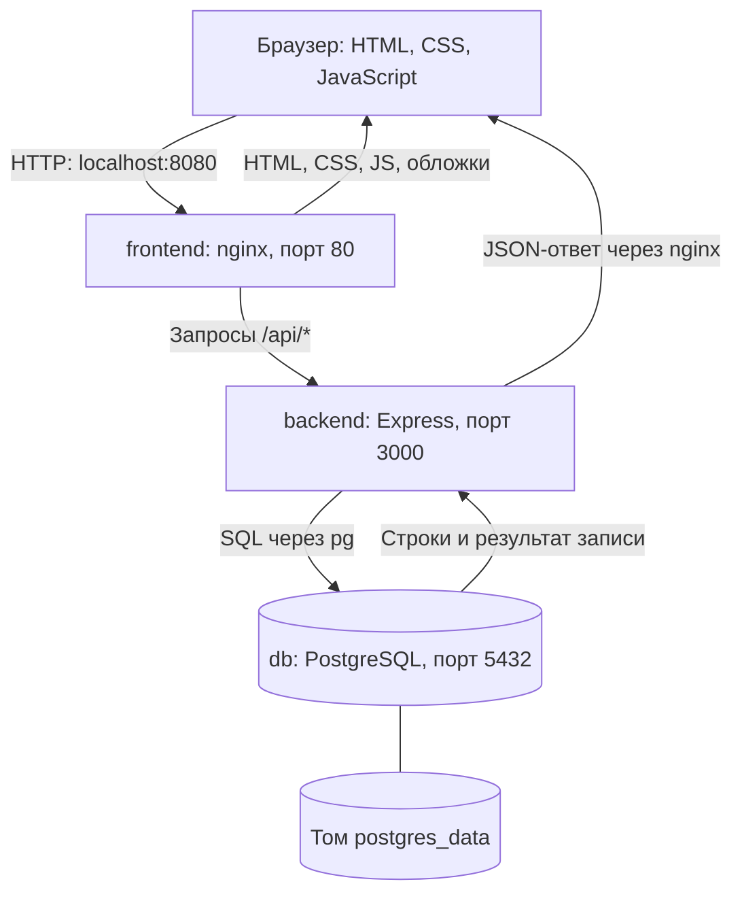

# Как устроен «Кадр»

## Где что лежит

| Путь внутри Lab0 | Что находится |
|---|---|
| frontend/ | HTML, CSS и JavaScript, которые работают в браузере; обложки и настройка nginx |
| backend/src/ | Сервер Node.js: API, авторизация, валидация, запросы к PostgreSQL |
| database/schema.sql | Описание таблиц, связей, ограничений и индексов |
| database/seed.sql | Начальное наполнение: фильмы, жанры и цитаты |
| backend/test/ | Проверки API с настоящим PostgreSQL |
| compose.yaml | Запуск трёх сервисов и подключение постоянного тома |
| Dockerfile | Сборка контейнера бэкенда |
| frontend/Dockerfile | Сборка контейнера с nginx и файлами интерфейса |
| docs/ | Скриншоты и документация |

Папка `database/` содержит инструкции для создания и наполнения БД. Сами пользовательские записи хранятся в PostgreSQL, а при запуске через Compose — в томе `postgres_data`, а не внутри SQL-файлов.

## Роли трёх частей

**Фронтенд** — видимая пользователю часть. `index.html` задаёт страницу, `styles.css` отвечает за оформление, `app.js` показывает фильмы и отзывы, обрабатывает кнопки и отправляет запросы через `fetch`. JavaScript интерфейса выполняется в браузере пользователя.

**Бэкенд** — программа на сервере. `app.js` принимает запросы API, проверяет вход и права автора, проверяет данные и выполняет SQL. `auth.js` отвечает за хеширование паролей и сессии. `db.js` создаёт пул соединений с PostgreSQL, при старте выполняет схему и начальное наполнение. `server.js` запускает HTTP-сервер.

**База данных** — отдельный сервер PostgreSQL. Он хранит пользователей, сессии, фильмы, жанры, цитаты и отзывы. Бэкенд обращается к нему через библиотеку `pg`, используя параметры подключения из `DATABASE_URL`.

## Сеть при запуске Docker Compose

Контейнер `frontend` содержит nginx. Он отдаёт статические файлы, а обращения к `/api/` пересылает на `http://backend:3000`. Имена `backend` и `db` разрешаются во внутренней сети Compose. Браузер использует только `http://localhost:8080`.

У бэкенда адрес БД — `db:5432`. `localhost` внутри контейнера означал бы сам этот контейнер, поэтому для обращения к соседней БД используется имя `db`. PostgreSQL также опубликован на локальном порту компьютера для удобства проверки, но фронтенд этим портом не пользуется.

## Пример: публикация ревью

1. Пользователь выбирает фильм, оценку и цитату, вводит текст.
2. Фронтенд собирает JSON и отправляет `POST /api/reviews`. Браузер автоматически прикрепляет cookie сессии.
3. nginx пересылает запрос бэкенду.
4. Бэкенд находит сессию в PostgreSQL, определяет автора, проверяет оценку 1–10, длину текста и принадлежность цитаты фильму. ID автора берётся из сессии, а не из данных формы.
5. Бэкенд выполняет `INSERT INTO reviews ...` с параметрами. PostgreSQL сохраняет строку и возвращает её ID.
6. Бэкенд возвращает JSON с кодом `201`, nginx передаёт ответ браузеру.
7. Интерфейс открывает стену и запрашивает `GET /api/reviews?user=ID`. Бэкенд читает отзывы через `SELECT`, возвращает JSON, фронтенд строит список.

После обновления страницы браузер снова запрашивает стену. Отзывы остаются, потому что читаются из PostgreSQL. Перезапуск бэкенда их не затрагивает. Постоянный том сохраняет БД при обычном пересоздании контейнеров; удаление тома удаляет и данные.

## Порядок старта

Compose сначала запускает PostgreSQL и ждёт успешной проверки готовности. Затем запускает бэкенд, который создаёт таблицы и добавляет исходный каталог без дублирования. После готовности API запускается nginx. Эти зависимости задаются в `depends_on` и `healthcheck`.

## Режим без Docker

При `npm start` Express отдаёт и интерфейс, и API на `http://localhost:3000`. Отдельный nginx в этом режиме не нужен. PostgreSQL всё равно остаётся отдельным сетевым сервисом; это требование лабораторной.
